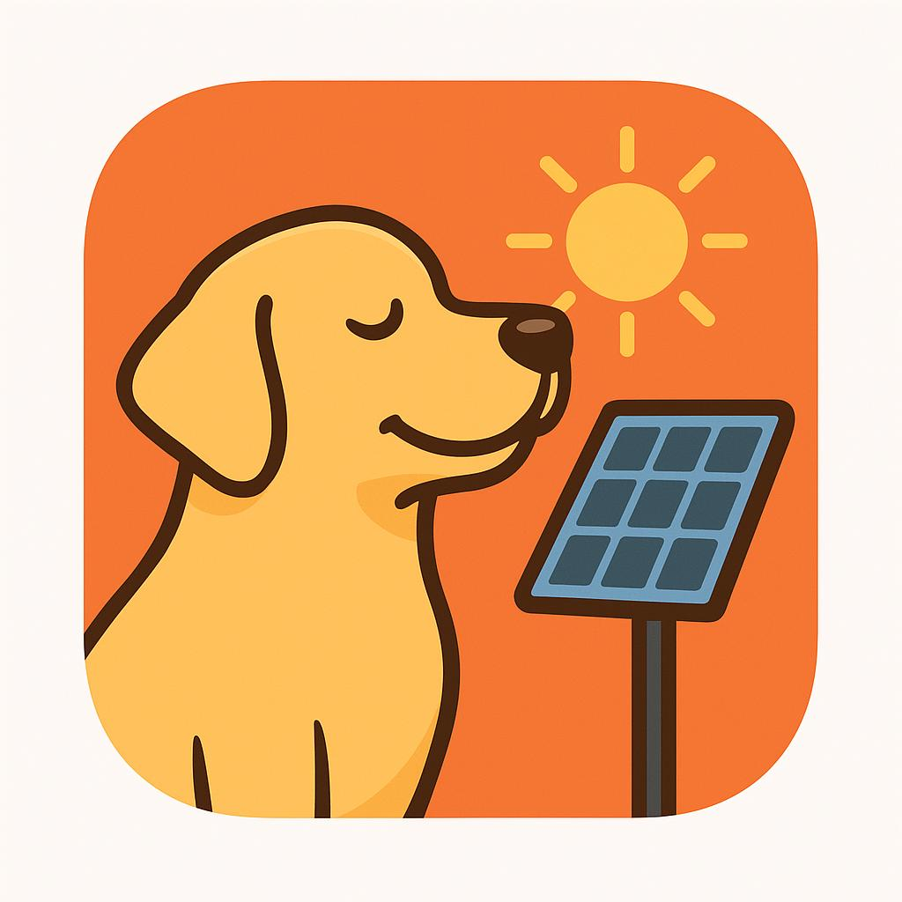

[](https://www.npmjs.com/package/iobroker.apsystems-ez1)
[](https://www.npmjs.com/package/iobroker.apsystems-ez1)


---

## Description
This adapter integrates with **APsystems EZ1 microinverters** via the device's **Local HTTP API (port 8050)**.  
It supports:
- Reading realtime power and energy
- Device info and alarms
- Setting MaxPower and On/Off state

---

## Author
**haining zhi** ([GitHub](https://github.com/zhihaining))

---


[](https://nodei.co/npm/iobroker.apsystems-ez1/)

**Tests:** 

## apsystems-ez1 adapter for ioBroker

## Developer manual
This section is intended for the developer. It can be deleted later.

### DISCLAIMER

Please make sure that you consider copyrights and trademarks when you use names or logos of a company and add a disclaimer to your README.
You can check other adapters for examples or ask in the developer community. Using a name or logo of a company without permission may cause legal problems for you.

### Getting started

You are almost done, only a few steps left:
1. Create a new repository on GitHub with the name `ioBroker.apsystems-ez1`
1. Initialize the current folder as a new git repository:  
    ```bash
    git init -b master
    git add .
    git commit -m "Initial commit"
    ```
1. Link your local repository with the one on GitHub:  
    ```bash
    git remote add origin https://github.com/Haining Zhi/ioBroker.apsystems-ez1
    ```

1. Push all files to the GitHub repo:  
    ```bash
    git push origin master
    ```
1. Add a new secret under https://github.com/Haining Zhi/ioBroker.apsystems-ez1/settings/secrets. It must be named `AUTO_MERGE_TOKEN` and contain a personal access token with push access to the repository, e.g. yours. You can create a new token under https://github.com/settings/tokens.

1. Head over to [main.js](main.js) and start programming!

### Best Practices
We've collected some [best practices](https://github.com/ioBroker/ioBroker.repositories#development-and-coding-best-practices) regarding ioBroker development and coding in general. If you're new to ioBroker or Node.js, you should
check them out. If you're already experienced, you should also take a look at them - you might learn something new :)

### State Roles
When creating state objects, it is important to use the correct role for the state. The role defines how the state should be interpreted by visualizations and other adapters. For a list of available roles and their meanings, please refer to the [state roles documentation](https://www.iobroker.net/#en/documentation/dev/stateroles.md).

**Important:** Do not invent your own custom role names. If you need a role that is not part of the official list, please contact the ioBroker developer community for guidance and discussion about adding new roles.

### Scripts in `package.json`
Several npm scripts are predefined for your convenience. You can run them using `npm run <scriptname>`
| Script name | Description |
|-------------|-------------|
| `test:js` | Executes the tests you defined in `*.test.js` files. |
| `test:package` | Ensures your `package.json` and `io-package.json` are valid. |
| `test:integration` | Tests the adapter startup with an actual instance of ioBroker. |
| `test` | Performs a minimal test run on package files and your tests. |
| `check` | Performs a type-check on your code (without compiling anything). |
| `lint` | Runs `ESLint` to check your code for formatting errors and potential bugs. |
| `translate` | Translates texts in your adapter to all required languages, see [`@iobroker/adapter-dev`](https://github.com/ioBroker/adapter-dev#manage-translations) for more details. |
| `release` | Creates a new release, see [`@alcalzone/release-script`](https://github.com/AlCalzone/release-script#usage) for more details. |

### Writing tests
When done right, testing code is invaluable, because it gives you the 
confidence to change your code while knowing exactly if and when 
something breaks. A good read on the topic of test-driven development 
is https://hackernoon.com/introduction-to-test-driven-development-tdd-61a13bc92d92. 
Although writing tests before the code might seem strange at first, but it has very 
clear upsides.

The template provides you with basic tests for the adapter startup and package files.
It is recommended that you add your own tests into the mix.

### Publishing the adapter
Using GitHub Actions, you can enable automatic releases on npm whenever you push a new git tag that matches the form 
`v<major>.<minor>.<patch>`. We **strongly recommend** that you do. The necessary steps are described in `.github/workflows/test-and-release.yml`.

Since you installed the release script, you can create a new
release simply by calling:
```bash
npm run release
```
Additional command line options for the release script are explained in the
[release-script documentation](https://github.com/AlCalzone/release-script#command-line).

To get your adapter released in ioBroker, please refer to the documentation 
of [ioBroker.repositories](https://github.com/ioBroker/ioBroker.repositories#requirements-for-adapter-to-get-added-to-the-latest-repository).

### Test the adapter manually with dev-server
Since you set up `dev-server`, you can use it to run, test and debug your adapter.

You may start `dev-server` by calling from your dev directory:
```bash
dev-server watch
```

The ioBroker.admin interface will then be available at http://localhost:undefined/

Please refer to the [`dev-server` documentation](https://github.com/ioBroker/dev-server#command-line) for more details.

## Changelog
<!--
    Placeholder for the next version (at the beginning of the line):
    ### **WORK IN PROGRESS**
-->
### 0.1.3 (2025-12-10)
- Describe changes for this release

### 0.1.3 (2025-12-10)
- Describe changes for this release


### 0.1.2 (2025-12-10)
- Fix JSON parsing and repository checker issues; add adminUI config and icons.

### 0.1.1 (2025-11-30)
- Initial release

### Features
- Polls /getDeviceInfo, /getOutputData, /getMaxPower, /getAlarm, /getOnOff
- Allows /setMaxPower and /setOnOff via adapter states
- Supports multiple devices in a single adapter instance (devices array)
- HTTP timeout and retry logic (axios + axios-retry)
- Basic alerting via email when repeated errors occur

### Installation (development)
1. Copy repository into your ioBroker development folder or clone to the ioBroker host.
2. Run `npm install` inside the adapter folder.
3. In ioBroker Admin -> Adapters -> Install from `io-package.json` or use `iobroker add apsystems-ez1` / `iobroker upload`.
4. Configure the adapter instance: set Devices (JSON array) or single deviceIp, poll interval, timeout, retries.

### Configuration
- Devices: JSON array, e.g. `[{ "name":"Roof", "ip":"192.168.1.50" }, { "name":"Garage", "ip":"192.168.1.51" }]`
- pollInterval: seconds between polls (default 30)
- httpTimeout: ms timeout for HTTP requests
- httpRetries: number of retries for transient failures
- alertEmail: optional email address to receive persistent error alerts (requires local sendmail)

### States (created under `apsystems-ez1.0.devices.<Name>.*`)
- deviceId (string) - Device ID
- devVer (string) - Firmware version
- ssid (string) - Connected SSID
- ipAddr (string) - Device IP
- minPower (number) - Min supported power (W)
- maxPower (number) - Max supported power (W)
- output.p1 (number) - Power channel1 (W)
- output.p2 (number) - Power channel2 (W)
- output.e1 (number) - Energy channel1 (kWh)
- output.e2 (number) - Energy channel2 (kWh)
- output.te1 (number) - Lifetime energy channel1 (kWh)
- output.te2 (number) - Lifetime energy channel2 (kWh)
- control.maxPower (number, write) - Set Max Power (W)
- control.onOff (number, write) - Set On/Off (0=On,1=Off)
- alarm.og (number) - Off-grid alarm (0/1)
- alarm.isce1 (number) - DC1 short circuit (0/1)
- alarm.isce2 (number) - DC2 short circuit (0/1)
- alarm.oe (number) - Output fault (0/1)

### VIS2 widget
A VIS2 widget template is included under `vis2/ez1-control` to show power, energy and controls. Update the widget to use your adapter instance id if required.

### API endpoints (EZ1 Local API) — from official manual
- GET /getDeviceInfo
- GET /getOutputData
- GET /getMaxPower
- GET /getAlarm
- GET /getOnOff
- GET /setMaxPower?p=VALUE
- GET /setOnOff?status=0|1

### Publishing to GitHub
1. Create a repository named `iobroker.apsystems-ez1` on GitHub.
2. Push the folder contents to the repo.
3. Users can install using ioBroker Admin -> Install from URL or via `iobroker install https://github.com/<user>/iobroker.apsystems-ez1`


## License
MIT License

Copyright (c) 2025 Haining Zhi <zhihaining@gmail.com>

Permission is hereby granted, free of charge, to any person obtaining a copy
of this software and associated documentation files (the "Software"), to deal
in the Software without restriction, including without limitation the rights
to use, copy, modify, merge, publish, distribute, sublicense, and/or sell
copies of the Software, and to permit persons to whom the Software is
furnished to do so, subject to the following conditions:

The above copyright notice and this permission notice shall be included in all
copies or substantial portions of the Software.

THE SOFTWARE IS PROVIDED "AS IS", WITHOUT WARRANTY OF ANY KIND, EXPRESS OR
IMPLIED, INCLUDING BUT NOT LIMITED TO THE WARRANTIES OF MERCHANTABILITY,
FITNESS FOR A PARTICULAR PURPOSE AND NONINFRINGEMENT. IN NO EVENT SHALL THE
AUTHORS OR COPYRIGHT HOLDERS BE LIABLE FOR ANY CLAIM, DAMAGES OR OTHER
LIABILITY, WHETHER IN AN ACTION OF CONTRACT, TORT OR OTHERWISE, ARISING FROM,
OUT OF OR IN CONNECTION WITH THE SOFTWARE OR THE USE OR OTHER DEALINGS IN THE
SOFTWARE.
